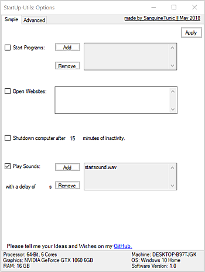
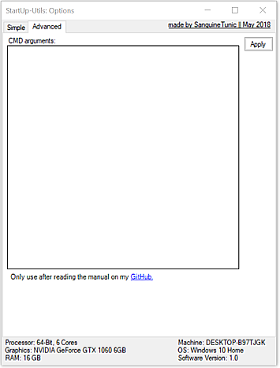

## Projects                                     

### Current Projects

#### Sanguine's Startup Utilities

A simple Windows program made to execute various things after the startup of your System.
It can be used to open your daily working environment or to greet the whole office with the daily dose of your favourite song!
You can also use it to run any CMD command or to automatically shutdown your system after a fixed time.

Any wishes and improvments are highly whished to be posted in my  <a href="https://www.tapatalk.com/groups/sanguinetunic/suggestions-and-wishes-t2.html">Suggestions and Wishes</a> thread.
And a Linux and/or Mac version might be coming, if enough people request it.

Here you can see the current two pages of the options Menu:

 

<button type="button" href="https://github.com/SanguineTunic/StartupUtilites/releases">Windows</button> <button type="button" href="">Coming Soon</button>
<a href="https://github.com/SanguineTunic/StartupUtilites">(Repository)</a>

### Future Projects

You can post Wishes and Ideas for future Projects in my <a href="https://www.tapatalk.com/groups/sanguinetunic/roadmap-t3.html">Roadmap</a> thread.

## Polls

Currently no poll is running. For further Infos please visit <a href="https://www.tapatalk.com/groups/sanguinetunic">My Forum</a>.
